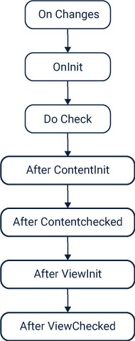

# ANGULAR

## Introduction and Basics
- [What is Angular](#what-is-angular)
- [Creating first Angular Project](#creating-first-angular-project)
- [How does an angular app gets loaded and started](#how-does-an-angular-app-gets-loaded-and-started)
- [Components](#components)
- [Data Binding](#data-binding)
- [Directives](#directives)

## Components and Data Binding
- [Property and Event Binding](#property-and-event-binding)
- [Binding to Custom Properties](#binding-to-custom-properties)
- [Binding to Custom Events](#binding-to-custom-events)
- [Getting Access to Template and DOM](#getting-access-to-template-and-dom)
- [Component Life Cycle](#component-life-cycle)
- [Directives](#directives)

## Directives


---
## **What is Angular**

Angular is simply a javascript framework designed so that we can create web pages on a single page (SPAs).

The advantages of such method is that we create a reactive page for user experience and also it is much faster to load different pages in js than from server.

In angular there is only one single web page and that page contains all different components in it which feels like different web pages for user but in fact comes under a single web page.

[^Top](#introduction-and-basics)

---
## **Creating first Angular Project**
To create an angular project we need to install angular cli to our system, along with node js. Node js is required to run the npm commands and we require npm commands to create the project.

The npm command is availabel once we download angular cli.

Then once everything is install just simply type

```
ng new my-first-app
```
[^Top](#introduction-and-basics)

---

## **How does an angular app gets loaded and started**
When we createan angular application we create certain in built files. So when we go for ng serve our main html file, i.e. index.html starts running.

Now when this file starts it has the <app-selector> tag in its code and this selector is also there in app-component.ts file and so this index html file calls the app-component html file and we see the code.

But here one interesting question arises. How does angular knows that we have an app component. For that we have one main.ts file. This is the main ts file and its the file that gets executed first.

If we open the file we have one call to the bootstrap which requires an array argument to pass.

This call refers to the app.module.ts file and in that file we pass the bootstrap array with app component.

So now here at this point our angular application is told that at runtime you should know a component as app component. So when our index.html gets executed this component is called.

[^Top](#introduction-and-basics)

---

## **Components**

Components are the building blocks for any angular application. We build our whole project using components.

We can create components in 2 ways. Manually or using angular cli.

Angular cli method is more preferred as it gives us with reduced headache of referring modules and all but we should manual too.

```TypeScript
ng generate component component-name-here
```

This generates a component with required name.

When we create a component then in the app-modules section that components gets imported. 

In app module NgModule tag we have certain properties :-
Declarations basically for declaration of the components here
imports for module imports.
providers for services
bootstrap to tell which all components the angular should know before the start of project.

Now these properties are for angular to know these exist but for typescript we need to import all these things above this using import method.

When we create a component we declare a component keyword with 3 properties of selector,templateUrl and styleurl

In Selector we tell the type of selector we have to use to call this particular component.The selector can be anything, a class, attribute or the element itself(by default element).

In the templateUrl we have 2 options go with template or url. If its template then the html part of the component is wriiten there only and if its url we give path for the html file. But we can have only one url here.

The last part by default which comes is stylesUrl. Here we have an array in which we can specify the urls for different css files which will be used for the component. Here also we can have url or just styles like above scenario.


[^Top](#introduction-and-basics)

---

## **Data Binding**
Data binding is way of communicating between the html page and the ts or typescript page of the project.

Data binding is mainly of 2 types :-

1.  One way data binding.
2. Two way data binding.

One way data binding is achieved through string interpolation and property binding and event binding.

For two way data binding we use ngModel.

**String Interpolation**
We have simple syntax for the above.
We just declare a method or variable in the ts file and when we have to call it in html we use curly braces.

```TypeScript
    {{variablenamehere}}
```
**Property Binding**
For property binding the simple point is that any html element have certain properties so if we wish to change them dynaically then we use property binding

```TypeScript
    [propertynamehere]="variablenamehere"
```

**Event Binding**
When we do any action or activity in the dom certain events get triggered. So on these trigger of events we can bind them to any variable or function method.

```TypeScript
    (click)="variablenamehere"
```

**Two way binding**
In case of two way binding we use a different kind of variable or system. Here we use [(ngModel)] and bind this with any variable name.

Now here when we bind tis variable name so if we update this in our dom it gets updated in the ts file too.

```TypeScript
    [(ngModel)] = "variablenamehere"
```

[^Top](#introduction-and-basics)

---

## **Directives**
Directives are basically instructions to give to dom.

A component is also a directive. A directive typically contains @Directive symbole in the start and then there is information regarding that directive. Just like we studied for component.

We can create our own directives but there are certain built in directives too.

**ngIf** 

This directive is used to output the content in dom based on condition.

Since it changes the structure of dom it is also called as structural directive. If the condition mentioned inside ngif becomes true then that element is seen else not.

Syntax :-
```TypeScript
*ngIf = "Condition or variable or a method here returning boolean value"
```
>Here we use * before ngif as it is syntax that represents a structural directive 

We can extend the ngif by also using else with it syntax for which is :-

```TypeScript
    *ngIf = "Condition or variable or a method here returning boolean value; else variable name to the other element"
```

But generally we don't preferr else as we need to give a variable name to element tag and also we need to enclose else element inside <ng-template> tag. 

A better solution is use ! before the condition you are giving for ngif.

**ngStyle**

If we want to dynamically change the style for any element then we use ngstyle.

Syntax :-

```TypeScript
    [ngStyle] = "{backgroundColor:blue}"
```

Since ngStyle is not a structural directive we don't use * here but we use [] to bind it with properties(just like property binding). 
>Ngstyle expects a javascript object to be passed to it.

Since it requires javascript object, the key is the property name and value is the condition or value for that property.

**ngClass**

Previously we saw how to change the style and properties of an element using ngstyle. We can also dynamically add or remove a class from an element and that can be done using ngClass.

Same like ngStyle it also requires a javascript object to be passed and also we use [] brackets just like ngStyle.

```TypeScript
[ngClass] = {classname:'condition or method here'}
```

Since it requires javascript object we have classname as key and condition as value.

**ngFor**

We have another structural directive called ngFor.

Now if we want to list out an array of values in our elements we use ngFor just like the for loop.

It is also a structural directive so we use * with it.

Syntax :
```TypeScript
*ngFor = "let server of servers"
```

Here server is the variable provided by us to loop through the variable servers which is declared in the ts file containing all values.

> A very important point for ngFor. Since its a for loop sometimes in our code we want to access the index of the point of the loop where we are currently in the array. So either we can make a variable as count for that in our ts file or simply we can change the syntax a bit to get the index.

```TypeScript
*ngFor = "let server in servers; let i=index"
```

> Now this i will have current position in the loop.It will start from 0 and so on.

[^Top](#introduction-and-basics)

---

## **Property and Event Binding**

We have already seen the built in property and event binding methods and ways in which that can be done effectively.

Now if we create our own property and our own event and we need to communicate that across the components then we need to use some other methods.

[^Top](#components-and-data-binding)

---

## **Binding to Custom Properties**
We sometimes needs to communicate with the custom properties and need to send the data values from the parent component to the child component.

For that purpose we use the keyword **@Input**

Steps :-
1. Let suppose we have one child component as server-element and our parent component is app.
2. Now in parent component using ngFor we are looping through each server-element and calling it again and again to create list of components.
3. But we have servers array object in app component only and not in server-element.
4. So this will throw error as we don't have any server in server-element and we need to pass each server to server-element.
5. Here we can use property binding.
6. First we will create a property as element in server-element and then add a decorative of @Input before it.
```TypeScript
@Input() element = {name:string,type:string,content:string};
```

Now just like property binding syntax we will bind this property with each server element that we are looping through in ngFor

```TypeScript
*ngFor = "let server of servers" [element] = "server"
```

> We can have a parameter inside @Input() also and this parameter is the aliasing name given to the property

[^Top](#components-and-data-binding)

---

## **Binding to Custom Events**
Same way like we binded the custom properties we can bind the events too.

In case of communicating from a child to parent we use **@Output()** decorater.

Steps :- 
1. Suppose we have child component as cockpit and parent is app.
2. Now in this cockpit component when we click on add Server button a server is getting created.
3. Now this was possible when we had all methods in app.ts but now we have a new child component.
4. So now we create a custom event of onServerCreated in app component and then pass parameters of data values we want from that event.
5. Then in cockpit component we create custom events and then we trigger them using .emit method.

```TypeScript
@Output() onServerCreate = new EventEmitter<Generic here>()
```

> Aliasing is followed here in the same way

[^Top](#components-and-data-binding)

---

## **Getting Access to Template and DOM**
We can access the template and dom in various ways as we have studied before, but we can do that in some other ways too.

1. Local Variable Reference
2. ViewChild() decorative

**Local Variable Reference**

For certain elements in our template we can assign a temporary variable

```HTML
#variablenamehere
```

This needs to be assigned inside the elements tag. Then we can use this variable anywhere in that template.

> Note that we can use the variable only in the template and not in ts file.

So next we can do is we can pass this as a parameter for any event we are referring to so that we can use it in ts file.

The value this variable will store is the whole element it is referring to.

```HTML
<input type="text" #serverName>
<button (click) = "serverMethods(serverName)"></button>
```
This variable will referr to the input element here.

**Using ViewChild()**
We have a decorative for the above purpose. The ViewChild() decorative enables us to referr to any element in the DOM in ts file.

In this decorative inside parenthesis we mention any component or any variable that we have assigned to the template(just like in previous case).

Then we assign this decorative to any variable we have created in the ts file.

The variable returns eventRef as its type.

```HTML
<input type="text" #serverName>
```
Now in ts file we have

```TypeScript
@ViewChild('serverName') serverNameInput;
```

And now we can use this variable in the ts file.
> The ViewChild() decorator has some different syntax for other versions of Angular so just check that accordingly. The part mentioned will be there.

**ng-content** 
(Read at last)

[^Top](#components-and-data-binding)

---

## **Component Life Cycle**



### **Lifecycle**
**ngOnChanges** Called after a bound input property changes

**ngOnInit** Called once the component is initialized

**ngDoCheck** Called during every change detection run

**ngAfterContentInit** Called after content (ng-content) has been projected into view

**ngAfterContentChecked** Called every time the projected content has been checked

**ngAfterViewInit** Called after the component’s view (and child views) has been initialized

**ngAfterViewChecked** Called every time the view (and child views) have been checked

**ngOnDestroy** Called once the component is about to be destroyed

[^Top](#components-and-data-binding)

---
